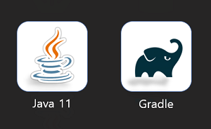
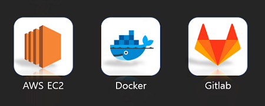
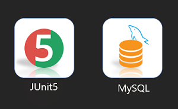
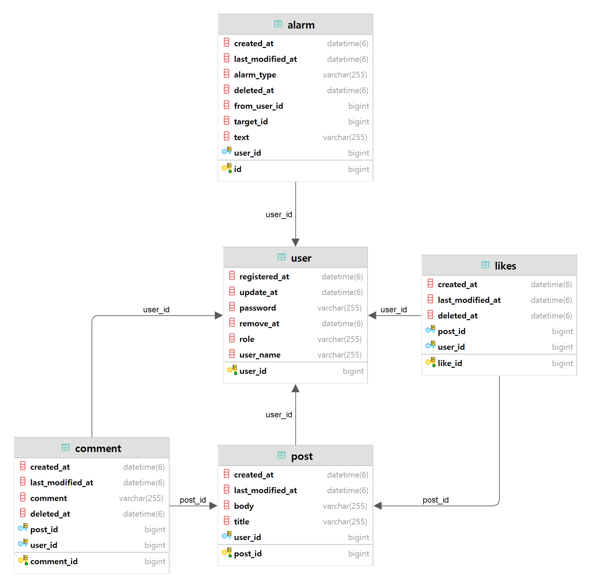
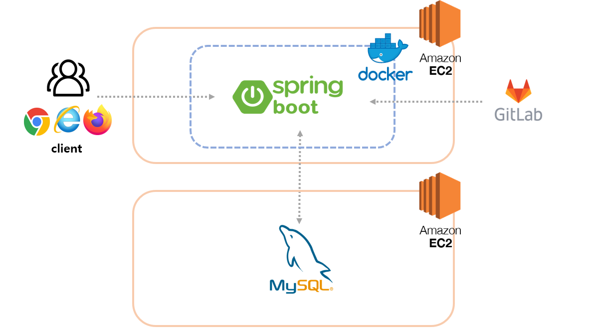
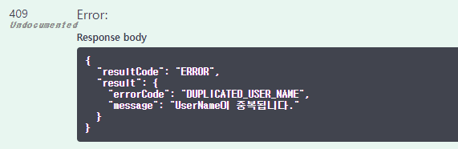
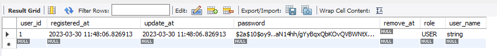

<div align="center">


<a href="http://ec2-43-201-18-57.ap-northeast-2.compute.amazonaws.com:8080/swagger-ui/" target="_blank"></a>
</div>

# MustsaSNS-API(멋사스네스)
1️⃣ 로그인   
2️⃣ 회원가입   
3️⃣ 글 작성/수정/삭제/리스트    
4️⃣ 댓글 작성/수정/삭제/리스트    
5️⃣ 좋아요    
6️⃣ 알람    
7️⃣ 마이피드 

1️⃣ ~ 7️⃣ 기능들을 사용하여 회원들끼리 소통하는 SNS 애플리케이션

## 📌 Swagger:
2023-06-11 update    
http://ec2-15-164-93-201.ap-northeast-2.compute.amazonaws.com:8080/swagger-ui/

# 개발환경
- 에디터 : Intellij Ultimate
- 개발 툴 : SpringBoot 2.7.5
- 자바 : JAVA 11
- 빌드 : Gradle 6.8
- 서버 : AWS EC2
- 배포 : Docker / Gitlab
- 데이터베이스 : MySql 8.0

# Tech Stack
### back_end

### tool

### infra

### test & DB


# ERD


# Architecture


### ✅ AWS EC2
- AWS EC2 사용(Ubuntu 22.04)
    - DB 서버 / 프로젝트 배포 서버 2개 인스턴스 생성
### ✅ Dokcer
- 위에서 생성한 서버에 Docker를 설치하고 MySQL과 Spring Boot 프로젝트를 컨테이너로 실행
### ✅ Database -> mySQL
### ✅ CI / CD -> Gitlab + Crontab
- CI : 도커 빌드 스크립트 Gitlab Pipelines 로 실행 후 도커이미지 생성
- CD : 생성 된 도커이미지를 pull 받아 컨테이너로 실행되는 스크립트 작성 후 Crontab으로 자동화

# EndPoint
> 회원가입
`POST /api/v1/users/join`

> 로그인
`POST /api/v1/users/login`

> 포스트 전체 조회
`GET /api/v1/posts`

> 포스트 1개 조회
`GET api/v1/posts/{postId}`

> 포스트 등록
`POST api/v1/posts`

> 포스트 수정
`PUT api/v1/posts/{postId}`

> 포스트 삭제
`DELETE /api/v1/posts/{postId}`

> 댓글 등록
`POST /api/v1/posts/{postId}/comments`

> 댓글 수정
`PUT /api/v1/posts/{postId}/comments/{id}`

> 댓글 삭제
`DELETE /api/v1/posts/{postId}/comments/{id}`

> 좋아요 누르기
`POST /api/v1/posts/{postId}/likes`

> 좋아요 개수
`GET /api/v1/posts/{postId}/likes`

> 받은 알람 조회
`GET /api/v1/alarms `

# 기능구현
### ✅ 프로젝트 빌드 
```java
dependencies {
	implementation 'org.springframework.boot:spring-boot-starter-data-jpa'
	implementation 'org.springframework.boot:spring-boot-starter-web'
        implementation 'org.springframework.boot:spring-boot-starter-security'
	implementation group: 'io.jsonwebtoken', name: 'jjwt', version: '0.9.1'
	runtimeOnly 'com.mysql:mysql-connector-j'
	annotationProcessor 'org.projectlombok:lombok'
        testImplementation 'org.projectlombok:lombok:1.18.22'
        compileOnly 'org.projectlombok:lombok'
	testImplementation 'org.springframework.boot:spring-boot-starter-test'
	implementation group: 'org.springframework.security', name: 'spring-security-test'
        implementation 'org.junit.jupiter:junit-jupiter:5.8.1'
	implementation "io.springfox:springfox-boot-starter:3.0.0"
	implementation "io.springfox:springfox-swagger-ui:3.0.0"
	implementation group: 'org.json', name: 'json', version: '20220924'
}
```
---
### ✅ 응답값 - resultCode / result로 나누어 반환
```json
{
  "resultCode": "",
  "result": {
    
  }
}
```
---
### ✅ `ExceptionHandler` + `RestControllerAdvice`
- 별도의 에러코드를 만들어 예외발생 시 해당하는 에러값을 json 형식으로 반환
```java
@RestControllerAdvice
public class ExceptionManager {

	@ExceptionHandler(AppException.class)
	public ResponseEntity<?> appExceptionHandler(AppException e) {
		ErrorResponse errorResponse = new ErrorResponse(e.getErrorCode(), e.getMessage());

		return ResponseEntity.status(e.getErrorCode().getStatus())
				.body(Response.error(errorResponse));
	}

}
```


---

### ✅ 회원가입/로그인 (url : `/api/v1/users`)
1. Spring Security + JWT
2. 회원가입 시 password 는 `BCryptPasswordEncoder` 클래스를 사용하여 암호화 후 DB 저장
3. 로그인 성공 시 Token 생성하여 반환    



> **회원가입 `POST /join`**
* Request
```json
{
  "userName": "user",
  "password": "user1234"
}
```
* Response
```json
{
  "resultCode": "SUCCESS",
  "result": {
    "userId": 1,
    "userName": "user"
  }
}
```
> **로그인 `POST /login`**

* Request
```json
{
    "userName" : "user",
    "password" : "user1234"
}
```
* Response
```json
{
  "resultCode": "SUCCESS",
  "result": {
          "jwt": "eyJhbGciOiJIU...",
        }
}
```

---

### ✅ 포스트 (url : `/api/v1/posts`)
1. 포스트 작성, 수정, 삭제
2. 포스트 (상세)조회 - Pageable 사용

> **포스트 등록 `POST ""`**

* Request
```json
{
    "title": "title1",
    "body": "body1"
}
```
* Response
```json
{
    "resultCode":"SUCCESS",
    "result":{
          "message":"포스트 등록 완료",
          "postId":0
        }
}
```

> **포스트 수정 `PUT /{postId}`**

* Response
```json
{
    "title" : "modified title",
    "body" : "modified body"
}
```
* Request
```json
{
    "resultCode":"SUCCESS",
        "result":{
          "message":"포스트 수정 완료",
          "postId":0
        }
}
```

> **포스트 삭제 `DELETE /{postId}`**

* Response
```json
{
    "resultCode":"SUCCESS",
        "result":{
          "message":"포스트 삭제 완료",
          "postId":0
        }
}
```

> **포스트 전체 조회 `GET ""`**    
Pageable ((최신순, 20개씩 표시))

* Response
```json
{
    "resultCode": "SUCCESS",
    "result": {
        "content": [
            {
                "id": 10,
                "title": "title1",
                "body": "body1",
                "userName": "userName1",
                "createdAt": "2022/12/22 10:43:25",
                "lastModifiedAt": "2022/12/22 10:43:25"
            },
            {
                "id": 9,
                "title": "title2",
                "body": "body2",
                "userName": "userName2",
                "createdAt": "2022/12/22 10:42:44",
                "lastModifiedAt": "2022/12/22 10:42:44"
            }
        ],
        "pageable": "INSTANCE",
        "last": true,
        "totalPages": 1,
        "totalElements": 4,
        "size": 4,
        "number": 0,
        "sort": {
            "empty": true,
            "sorted": false,
            "unsorted": true
        },
        "first": true,
        "numberOfElements": 4,
        "empty": false
    }
}
```

> **포스트 1개 조회 `GET /{postId}`**

* Response
```json
{
    "resultCode":"SUCCESS",
    "result":{
        "id" : 1,
        "title" : "title1",
        "body" : "body",
        "userName" : "user1",
        "createdAt" : "yyyy-mm-dd hh:mm:ss",
        "lastModifiedAt" : "yyyy-mm-dd hh:mm:ss"
    }
}
```

---

### ✅ 댓글 (url : `/api/v1/posts`)
1. 댓글 작성, 수정, 삭제, 조회

> **댓글 등록 `POST /{postId}/comments`**

* Request
```json
{
  "comment" : "comment test4"
}
```
* Response
```json
{
    "resultCode": "SUCCESS",
    "result":{
        "id": 4,
        "comment": "comment test4",
        "userName": "test",
        "postId": 2,
        "createdAt": "2022-12-20T16:15:04.270741"
    }
}
```

> **댓글 수정 `PUT /{postId}/comments/{id}`**

* Request
```json
{
  "comment" : "modify comment"
}
```
* Response
```json
{
  "comment" : "modify comment"
}
```

> **댓글 삭제 `DELETE /{postId}/comments/{id}`**

* Response
```json
{
    "resultCode": "SUCCESS",
    "result":{
        "message": "댓글 삭제 완료",
        "id": 4
    }
}
```

---

### ✅ 좋아요 (url : `/api/v1/posts`)
```java
if (optionalLike.isPresent()){ // like가 존재한다면,
    likeRepository.delete(optionalLike.get()); // like를 삭제한다.

    return LikeAddResponse.builder()
            .message("좋아요를 취소했습니다.")
            .build();

}else { // like가 존재하지 않는다면,
    likeRepository.save(Like.addLike(user, post)); // like를 저장한다.
    alarmRepository.save(Alarm.addAlarm(AlarmType.NEW_LIKE_ON_POST, user, post)); // 알람 저장

}
```
> **좋아요 누르기 `POST /{postId}/likes`**

* Request
```json
{
    "resultCode":"SUCCESS",
    "result": "좋아요를 눌렀습니다."
}
```
> 좋아요 조회(개수) `GET /{postId}/likes`

* Response
```json
{
    "resultCode":"SUCCESS",
    "result": 0
}
```

---

### ✅ 알람 (url : `/api/v1/alarms`)
1. Pageable (최신순, 20개씩 표시)

> **알람 리스트 `GET ""`**
* Response
```json
{
    "resultCode":"SUCCESS",
    "result": {
        "content":
        [
            {
                "id": 1,
                "alarmType": "NEW_LIKE_ON_POST",
                "fromUserId": 1,
                "targetId": 1,
                "text": "new like!",
                "createdAt": "2022-12-25T14:53:28.209+00:00"
            }
        ]
    }
}
```

---

### ✅ 마이 피드 (url : `/api/v1/posts`)
1. 로그인 된 유저만의 피드목록을 필터링하는 기능
2. Pageable 사용

> **마이 피드 조회 `GET /my`**
* Response
```json
{
  "resultCode": "SUCCESS",
  "result":{
        "content":
            [
                {
                "id": 4,
                "title": "test",
                "body": "body",
                "userName": "test",
                "createdAt": "2022-12-16T16:50:37.515952"
                }
            ],
        "pageable":
            {
                "sort":{"empty": true, "sorted": false, "unsorted": true }, "offset": 0},
                "last": true,
                "totalPages": 1,
                "totalElements": 1,
                "size": 20,
                "number": 0,
                "sort":{
                "empty": true,
                "sorted": false,
                "unsorted": true
            },
        "numberOfElements": 1,
        "first": true,
        "empty": false
    }
}
```